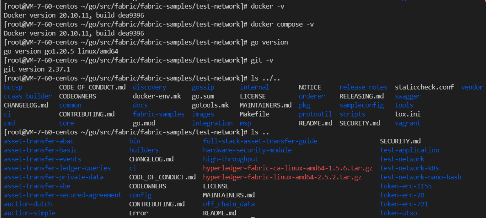
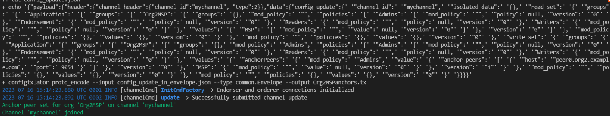
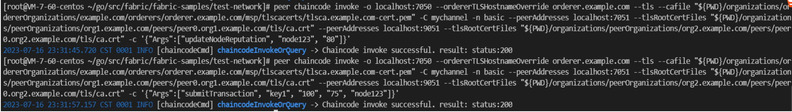
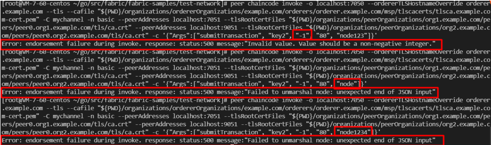

# SmartContracts
用go编写的智能合约项目，能在一定程度上防止女巫攻击和日蚀攻击

##
## 设计
*女巫攻击（sybil attack）是指利用社交网络中的少数节点控制多个虚假身份，从而利用这些身份控制或影响网络的大量正常节点的攻击方式。*

*日蚀攻击（eclipse attack）是区块链系统中一种恶意攻击手段，攻击者通过垄断受害节点网络，达到欺骗、控制目的。*

本文将用通过在智能合约的代码中，
（1）验证交易时间戳在一定程度上防止女巫攻击；
（2）用验证输入参数与节点信誉在一定程度上防止日蚀攻击。

###
### 女巫攻击-理论推导
在区块链网络中，每个交易都有一个时间戳，用于记录该交易的创建时间。验证交易时间戳的过程中，可以使用以下步骤：

（1）首先，确定每个交易的创建时间。这可以通过使用节点的系统时间来实现，或通过使用网络时间协议NTP来同步节点的时间，如prometheus系统就需要这种协议。

（2）而后，需验证每个交易的时间戳是否在当前时间之前。如果交易时间戳早于当前时间，说明该交易是合法的，否则该交易是无效的。

（3）验证交易时间戳的过程中，需考虑到网络延迟的问题。如果两个交易的时间戳非常接近，我们需要确保它们的顺序是正确的。这可以通过使用先进先出（FIFO）的队列等实现方式实现。

通过以上步骤，我们可以验证每个交易的时间戳，并确保所有交易的顺序是正确的。这可以防止女巫攻击，区块链是防篡改的，因为恶意节点无法通过控制大量的算力来篡改交易的时间戳。在该信誉机制中，只有真实的交易才能被认为是有效的，而所有的交易都必须按照正确的顺序进行。如果恶意节点试图篡改交易的时间戳，那么该交易将被视为无效的，并且不会被记录在区块链中。因此，可以一定程度地防止女巫攻击。

###
### 日蚀攻击-理论推导
在区块链网络中，每个交易都包含输入参数，用于描述该交易的内容。在验证输入参数的过程中，可以使用以下步骤：

（1）首先，需要验证每个输入参数的真实性。这通过信誉度量机制来实现，如使用声誉系统来跟踪每个节点的行为，并根据其历史行为来评估其可信度。只有经过验证的输入参数才认为是有效的。

（2）接下来，需要验证每个交易的输入参数是否与之前的交易相符。这可通过使用哈希函数来实现，例如SHA-256。每个交易都有一个哈希值，该哈希值由该交易的输入参数和输出参数计算而来。可以将前一笔交易的哈希值作为当前交易的输入参数之一，从而确保所有交易的顺序是正确的。

（3）验证输入参数的过程中，仍需考虑到网络延迟的问题。为确保交易顺序正确，可通过先进先出（FIFO）的队列等实现方式去实现。

总之，可验证每个交易的输入参数，并确保所有交易的顺序是正确的。这可以防止日蚀攻击，因为攻击者无法通过控制足够多的验证节点来篡改交易记录。如果攻击者试图篡改交易的输入参数，那么该交易将被视为无效的，并且不会被记录在区块链中。因此，可以有效地防止日蚀攻击。

##
## Docker部署并验证
本篇使用部署在Linux操作系统，发行版为CentOS。

步骤大致流程：
一、前置安装；二、部署Hyperledger Fabric网络；三、网络测试；四、编写、编译打包智能合约；五、部署链码；六、测试链码

###
（1）准备环境：安装Docker（版本20.10.11），docker-compose（20.10.11），Go（版本1.20.5），Git（版本2.37.1），fabric源码和fabric-samples。

docker安装
``` bash
sudo yum install -y yum-utils
sudo yum-config-manager --add-repo https://download.docker.com/linux/centos/docker-ce.repo
sudo yum install docker-ce docker-ce-cli containerd.io
sudo systemctl enable --now docker  # 启动 Docker 并设置为开机启动
```
docker-compose安装：
``` bash
sudo curl -L "https://github.com/docker/compose/releases/latest/download/docker-compose-$(uname -s)-$(uname -m)" -o /usr/local/bin/docker-compose
sudo chmod +x /usr/local/bin/docker-compose
```
Go和Git安装：
``` bash
# 安装Go
wget https://golang.org/dl/go1.17.2.linux-amd64.tar.gz
sudo tar -C /usr/local -xzf go1.17.2.linux-amd64.tar.gz
echo "export PATH=$PATH:/usr/local/go/bin" >> ~/.bashrc
source ~/.bashrc
# 发行版RHEL/CentOS安装Git
sudo yum install git
# 发行版Debian/Ubuntu安装Git
sudo apt-get update
sudo apt-get install git
```
作者使用版本：


####
（2）部署Hyperledger Fabric

安装fabric源码和安装fabric-samples
（需要PATH（../fabric-samples/bin的文件路径）、GOPATH（../go的文件路径）、FABRIC_CFG_PATH(../fabric-samples/config的文件路径)、CORE_PEER_MSPCONFIGPATH（加密msp路径）
）
``` bash
git clone https://github.com/hyperledger/fabric.git
cd fabric
git clone https://github.com/hyperledger/fabric-samples.git
# 然后安装fabric镜像
# 查找VERSION和CA_VERSION
cat scripts/bootstrap.sh   
# 按对应版本下载解压压缩包
cd fabric-samples  
wget https://github.com/hyperledger/fabric/releases/download/v2.5.2/hyperledger-fabric-linux-amd64-2.5.2.tar.gz
tar -zxvf hyperledger-fabric-linux-amd64-2.5.2.tar.gz
wget https://github.com/hyperledger/fabric-ca/releases/download/v1.5.6/hyperledger-fabric-ca-linux-amd64-1.5.6.tar.gz
tar -zxvf hyperledger-fabric-ca-linux-amd64-1.5.6.tar.gz
# 按脚本安镜像
cd ../scripts
./bootstrap.sh -s -b
```
若你配置的镜像无法下载，或者显示报错：Error response from daemon: toomanyrequests: You have reached your pull rate limit. You may increase the limit by authenticating...

建议切换镜像，比如用腾讯云的镜像，亲测有效，修改/etc/docker/daemon.json为：
``` json
{
    "registry-mirrors": [
        "https://mirror.ccs.tencentyun.com",
        "https://hub-mirror.c.163.com",
        "https://mirror.baidubce.com"
    ]
}
```

###
（3）网络测试

fabric-samples/test-network/下，启动脚本以启动fabric网络
``` bash
./network.sh up
```
网络由两个peer节点，一个order节点构成。


###
（4）编写、编译打包智能合约
智能合约（smart contract）本质上是一段运行在区块链网络上的业务逻辑代码，定义了业务资产和不同组织的业务逻辑，是区块链应用的核心业务逻辑。

与智能合约对应的是链码，一个链码里可以包含多个智能合约。智能合约负责业务逻辑，而链码负责的是怎样将智能合约进行打包、部署。通常，系统管理员关注的是链码，业务人员和开发人员关注的是智能合约。

Fabric使用了Docker来存放链上的代码，而不需要依靠特定的虚拟机，Docker为链码执行提供了一个安全、轻便的语言执行环境。智能合约（Smart Contract）经常与账本（Ledger）联系在一起，账本保存了业务对象当前状态和历史状态。
``` bash
# 配置CORE_CHAINCODE_ID_NAME，与core.yaml的chaincode属性对应即可
export CORE_CHAINCODE_ID_NAME=<chaincode_id_name>:1.0
# 构建docker镜像
docker build -t <chain_name>:1.0 
# 编译智能合约
go build <main.go>
```

###
（5）部署链码
/etc/hosts配置域名，创建通道，进行网络交互。
``` bash
#  启动Fabric网络后，安装链码到这个网络
peer chaincode install -n mychain -v 1.0 -p mychain 

sudo ./network.sh createChannel
```
创建通道成功：

启动链码：


####
（6）测试链码

按自定义智能合约测试，调用updateNodeReputation将节点ID名node123信誉值赋为80，并用该节点提交具有key1-100交易，提供交易信誉值75，


##
## 验证信誉度量机制的有效性
*可信服务网格（TSM）：是一种基于云原生技术的服务网格解决方案，旨在提供高度可信的服务通信和安全保障，它是建立在服务网格的基础上，通过加强安全性、可靠性和可观测性等方面的能力，使服务网格在企业级应用更加可信。*

*其设计理念是将安全性和可信性嵌入服务通信的各个环节，从而保障服务的可信性，它提供了多种安全机制：如身份认证、访问控制、数据加密等，以保障服务的安全性。还提供可靠性和可观测性功能，如流量控制、故障转移、监控等，以确保服务的高可用性和可观测性。*

*其实现方式：通过在服务网格引入可信节点实现，这些服务节点可以是物理机、虚拟机或容器，节点间提供网络互相通信形成网络，可信服务网格通过在网格中部署代理实现对服务间通信的安全管理和控制。这些节点具高度可信的身份和安全性，可以对服务通信进行安全加密、访问控制等。从而确保服务通信的可信性。实现方式包括搭建主链和侧链、设计交易结构、实现跨链交易、实现共识机制和实现智能合约等*

###
在测试环境中Fabric网络已启动并运行正常。

Golang编写的智能合约（链码）安装和实例化到网络中的对等节点。

模拟女巫攻击：攻击者创建多个虚假身份来控制网络，因机器数目、环境与实验环境有限，本篇通过使用过期的交易时间戳或无效的参数调用智能合约。


模拟日蚀攻击：攻击者试图通过控制目标节点的所有对等连接来影响网络。往往攻击者可能会尝试发送具有较低信誉值的交易。这里使用低于节点信誉值的信誉分数调用智能合约。

显然以上恶意调用（模拟攻击）都失败，有一定有效性。


